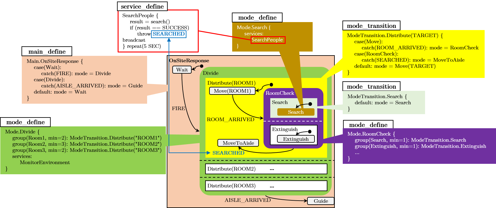

# Script Language Grammar of "A Novel Framework for Multi-robot Programming: From High-level Language Script to Distributed Deployment"

This repository contains the script grammar and the script of the motivational example.

## Files

Script.g4 - The grammar of the high-level specification

motivation\_example.bdl - The full script of the motivational example shown in Figure 4 of the paper.

## Structure of the Script with the Motivational Example and its Statecharts

The above image shows the relationship among script grammar, script example code, and Statecharts.

Colored area of Statecharts is corresponds to a textbox with a code example.

By cross-referencing _mode\_define_ and _mode\_transition_ in an hierarchical order, hierarchical finite state machine can be specified by our proposed script language.

_service\_define_ is used in _mode\_define_ to designate the behavior of robots in the specific mode.

_throw\_statement_ actually triggers an event which affects to the transition of the state (By throwing the event __SEARCHED__ in the __SearchPeople__ service, the transition from __RoomCheck__ to __Move(AISLE)__ happens). 

## Explanation of Statements Used in _service\_define_

| syntax | Explanation | Example |
| --- | --- | --- |
| _throw\_statement_ | Throw an event | <code>throw SEARCHED</code> |
| _if\_statement_, _else\_statement_ | if/else conditional statement | <pre>if(cmd == "RC") {     throw RC else if (cmd == "START") {     throw START } else {     throw FINISH }</pre> |
| _loop\_statement_ | Execute the compounded statements until a specified condition is reached | <pre>loop (2 SEC, color != "YELLOW") {     report() }</pre> |
| _send\_statement_ | Send a message to other team or group leaders | <code>send(Team2, searchResult)</code> |
| _publish\_statement_ | Publish a message to robots of a target team or group | <code>publish(Team2 , found)</code> |
| _receive\_statement_ | Receive a message from robots from other team or group leaders | <code>rc\_cmd = receive(Team1, cmd)</code> |
| _subscribe\_statement_ | Subscribe a message from robots of a target team or group | <code>result = subscribe(Team1, found)</code> |
| _action\_statement_ | The function-style basic robot behavior which are already registered in the managed database of the framework | <code>isFound = searchObject(area, target)</code> |

